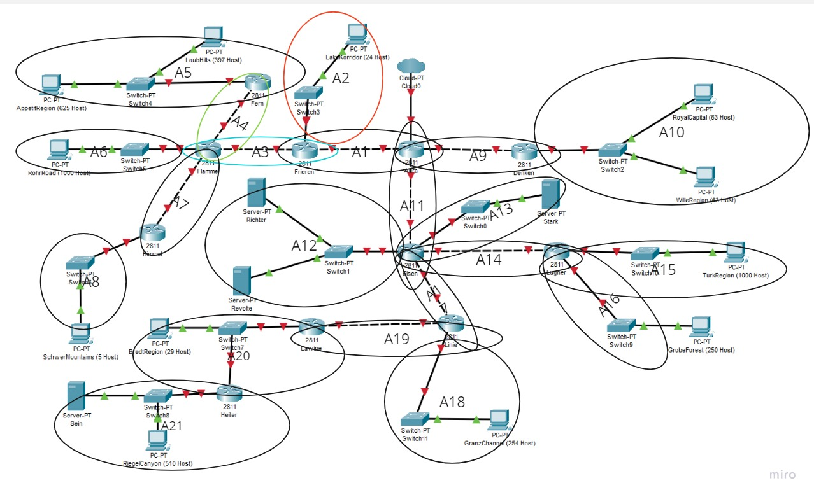
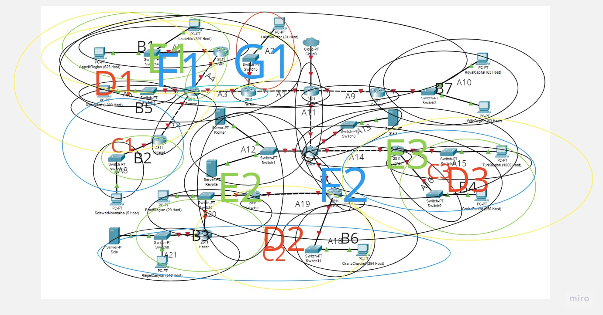

# Jarkom-Modul-4-F02-2023
Lapres Jaringan Komputer Modul 4

|NAMA|NRP|
|:--:|:-:|
|Moh Adib Syambudi|5025211017|

## Poin-poin yang perlu diperhatikan
### 1. Gunakan prefix IP sesuai dengan prefix IP masing-masing.
### 2. Terdapat template spreadsheet untuk mempermudah penilaian, gunakan template tersebut untuk melakukan penghitungan subnetting.
### 3. Hasil perhitungan subnetting dan pohon pembagian IP serta file .pkt di submit pada link di atas.
### 4. File yang didemokan adalah file .pkt yang telah disubmi5t
### 5. Pengurangan nilai akan dilakukan ketika:
####      a. Melanggar salah satu dari tulisan diatas.
####      b. Tidak menggunakan PREFIX ip yang ditetapkan sebelumnya
####      c. Hasil perhitungan untuk VLSM / CIDR, berbeda dengan di CPT / GNS3

### VLSM
Berikut adalah topologi yang digunakan 

#### Subnetting
Subnet dibuat dengan menggunakan metode VLSM dengan pembagian seperti berikut

Untuk detail dari pembagian subnet kita petakan ke dalam tabel berikut

| Nama Subnet | Rute                                            | Jumlah IP | Netmask |
| ----------- | ----------------------------------------------- | --------- | ------- |
| A1          | Aura-Frieren                                    | 2         | /30     |
| A2          | Frieren-Switch3-LakeKorridor                    | 25        | /27     |
| A3          | Frieren-Flamme                                  | 2         | /30     |
| A4          | Flamme-Fern                                     | 2         | /30     |
| A5          | Fern-Switch4-LaubHills-Switch4-AppetitRegion    | 1023      | /21     |
| A6          | Flamme-Switch5-RohrRoad                         | 1001      | /22     |
| A7          | Flamme-Himmel                                   | 2         | /30     |
| A8          | Himmel-Switch6-SchwerMountains                  | 6         | /29     |
| A9          | Aura-Denken                                     | 2         | /30     |
| A10         | Denken-Switch2-RoyalCapital-Switch2-WilleRegion | 127       | /24     |
| A11         | Aura-Eisen                                      | 2         | /30     |
| A12         | Eisen-Switch1-Richter-Switch1-Revolte           | 3         | /29     |
| A13         | Eisen-Switch0-Stark                             | 2         | /30     |
| A14         | Eisen-Lugner                                    | 2         | /30     |
| A15         | Lugner-Switch10-TurkRegion                      | 1001      | /22     |
| A16         | Lugner-Switch9-GrobeForest                      | 251       | /24     |
| A17         | Eisen-Linie                                     | 2         | /30     |
| A18         | Linie-Switch11-GranzChannel                     | 255       | /23     |
| A19         | Linie-Lawine                                    | 2         | /30     |
| A20         | Lawine-Switch7-BredtRegion-Switch7-Heiter       | 31        | /26     |
| A21         | Heiter-Switch8-Sein-Switch8-RiegelCanyon        | 512       | /22     |
| Total       | 4255                                            | /19       |

Kemudian IP dibagi dengan pohon VLSM yang dihitung mulai dari netmask terbesar yaitu /19. Berikut adalah gambar dari tree yang telah terbentuk

Hasilnya kemudian kita petakan kedalam tabel berikut

| Subnet | Network ID    | Netmask         | Broadcast      |
| ------ | ------------- | --------------- | -------------- |
| A1     | 192.222.0.0   | 255.255.255.252 | 192.222.0.3    |
| A2     | 192.222.0.64  | 255.255.255.224 | 192.222.0.95   |
| A3     | 192.222.0.4   | 255.255.255.252 | 192.222.0.7    |
| A4     | 192.222.0.8   | 255.255.255.252 | 192.222.0.11   |
| A5     | 192.222.8.0   | 255.255.248.0   | 192.222.15.255 |
| A6     | 192.222.4.0   | 255.255.252.0   | 192.222.7.255  |
| A7     | 192.222.0.12  | 255.255.255.252 | 192.222.0.15   |
| A8     | 192.222.0.40  | 255.255.255.248 | 192.222.0.47   |
| A9     | 192.222.0.16  | 255.255.255.252 | 192.222.0.19   |
| A10    | 192.222.24.0  | 255.255.254.0   | 192.222.25.255 |
| A11    | 192.222.0.20  | 255.255.255.252 | 192.222.0.23   |
| A12    | 192.222.0.48  | 255.255.255.248 | 192.222.0.55   |
| A13    | 192.222.0.24  | 255.255.255.252 | 192.222.0.27   |
| A14    | 192.222.0.28  | 255.255.255.252 | 192.222.0.31   |
| A15    | 192.222.16.0  | 255.255.252.0   | 192.222.19.255 |
| A16    | 192.222.1.0   | 255.255.255.0   | 192.222.1.255  |
| A17    | 192.222.0.32  | 255.255.255.252 | 192.222.0.35   |
| A18    | 192.222.2.0   | 255.255.254.0   | 192.222.3.255  |
| A19    | 192.222.0.36  | 255.255.255.252 | 192.222.0.39   |
| A20    | 192.222.0.128 | 255.255.255.192 | 192.222.0.191  |
| A21    | 192.222.20.0  | 255.255.252.0   | 192.222.23.255 |

#### Routing 

### CIDR
Berikut adalah topologi yang digunakan

#### Subneting
CIDR menggabungkan beberapa subnet hingga didapatkan satu subnet utama yang mencakup seluruh subnet.

Detail dari gambar diatas dipetakan kedalam tabel berikut

.png)

.png)

.png)

.png)

Setelah proses pembagian tiap subnet didapatkan IP dari metode CIDR pada tabel dibawah

| Subnet | Network ID     | Netmask         | Broadcast      |
| ------ | -------------- | --------------- | -------------- |
| A1     | 192.222.14.252 | 255.255.255.252 | 192.222.14.255 |
| A2     | 192.222.14.220 | 255.255.255.224 | 192.222.14.251 |
| A3     | 192.222.0.16   | 255.255.255.252 | 192.222.0.19   |
| A4     | 192.222.4.0    | 255.255.255.252 | 192.222.4.3    |
| A5     | 192.222.4.4    | 255.255.248.0   | 192.222.12.3   |
| A6     | 192.222.0.20   | 255.255.252.0   | 192.222.4.19   |
| A7     | 192.222.0.0    | 255.255.255.252 | 192.222.0.7    |
| A8     | 192.222.0.4    | 255.255.255.248 | 192.222.0.11   |
| A9     | 192.22.15.0    | 255.255.255.252 | 192.222.15.3   |
| A10    | 192.222.15.4   | 255.255.255.0   | 192.222.16.3   |
| A11    | 192.222.29.8   | 255.255.255.252 | 192.222.29.11  |
| A12    | 192.222.22.72  | 255.255.255.248 | 192.222.22.79  |
| A13    | 192.222.29.4   | 255.255.255.252 | 192.222.29.7   |
| A14    | 192.222.29.0   | 255.255.255.252 | 192.222.29.3   |
| A15    | 192.222.24.0   | 255.255.252.0   | 192.222.27.255 |
| A16    | 192.222.28.0   | 255.255.255.0   | 192.222.28.255 |
| A17    | 192.222.22.68  | 255.255.255.252 | 192.222.22.71  |
| A18    | 192.222.20.64  | 255.255.254.0   | 192.222..22.63 |
| A19    | 192.222.22.64  | 255.255.255.252 | 192.222.22.67  |
| A20    | 192.222.16.0   | 255.255.255.192 | 192.222.16.63  |
| A21    | 192.222.16.64  | 255.255.252.0   | 192.222.20.63  |

